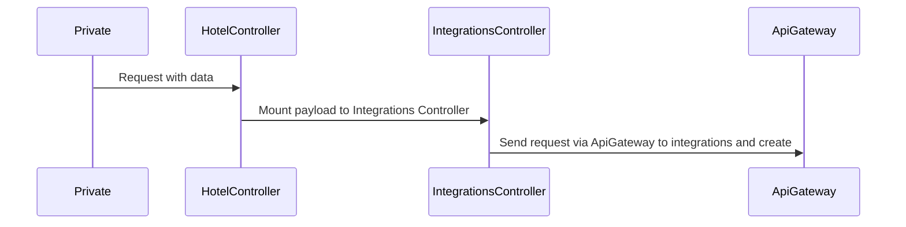

## Intro

Private is the page where we can configure all the products existing in Hotelinking.

## Integrations product

### Create
We can create PMS integrations for a brand, in order to do this, we have a form.

When all the data is completed, and we select to store this configuration, this form (generated in jquery in `public/js/hotelinking_integrations.js`), will call itself and refresh the page, but in background the controller (`controllers/private-invitar-hotelController.php`), will be listening this requests, and intercept this one, and depending on the conditions that are met, will perform one or another actions in this case.

Finally, we'll execute a POST request to integrations, with the following payload:

```json
{
    integration_config_id : "id of the configuration in DB",
    key : "auth key for this integration (only API)",
    secret : "secret for this integration (only API)",
    parser_hotel_code: "hotel code in PMS",
    connection_hotel_code: "hotel code in PMS",
    activated : "status of this integration",
    export : "status of export users in portal pro"
}
```

The request will be with method POST at `{baseUrl}/brand/:brandId/integration/:type`.

- brand_id: This is the brand identifier in the private.
- type: Is the kind of integration we'll like to create, can be: PMS, API or Redirect.

Once this process is completed, it will refresh the page, and the integration is created.

## Update

The Update method is the same as the Create method, but there's a few differences.

Foremost, the request made to ApiGateway is no longer a POST, now is a PUT, as we're updating the data for this integration, neither the endpoint, which now is `{baseUrl}brand/:brand_id/integration/:type/:integration_brand_id`.

This change is because we already have created the integration config, and therefore we have access to his unique identifier in database, so the parameters passed to this endpoint, are the following:

- brand_id: Same as before, the brand identifier in private.
- type: Type of the integration to be updated.
- integration_brand_id: ID of the integration brand in database.

The payload sent to the ApiGateway is the same as in create.

## Delete

Once we've already created an integration config, we can choose to delete it, in order to do this, we have a button to do it, as this form is calling itself, and we cannot create another to just delete this integration, we'll make use of the properties `name` and `action` of this button, to check if we're deleting or updating this integration.

The procedure is the same one as above, when we want to remove an integration config, in background the HotelController, is listening for this request, and if this requests is caught, and the conditions are met, it will call the Integrations controller, that himself will call to the method of ApiGateway and remove this integrationConfig.

As in Update method, the method has also changed.

The method to delete an integration is DELETE, the endpoint is the same one : `{baseUrl}/brand/:brand_id/integration/_type/_integration_brand_id`, the parameters are the same as above.

Once made the request to the ApiGateway the integrationConfig will be removed successfully.


## Sequence diagram
